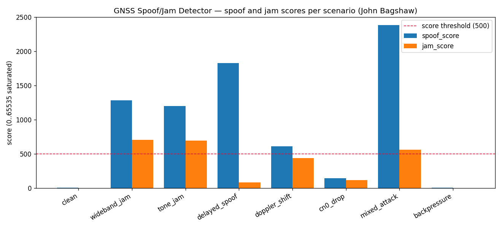
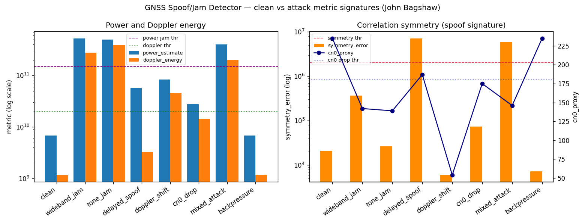
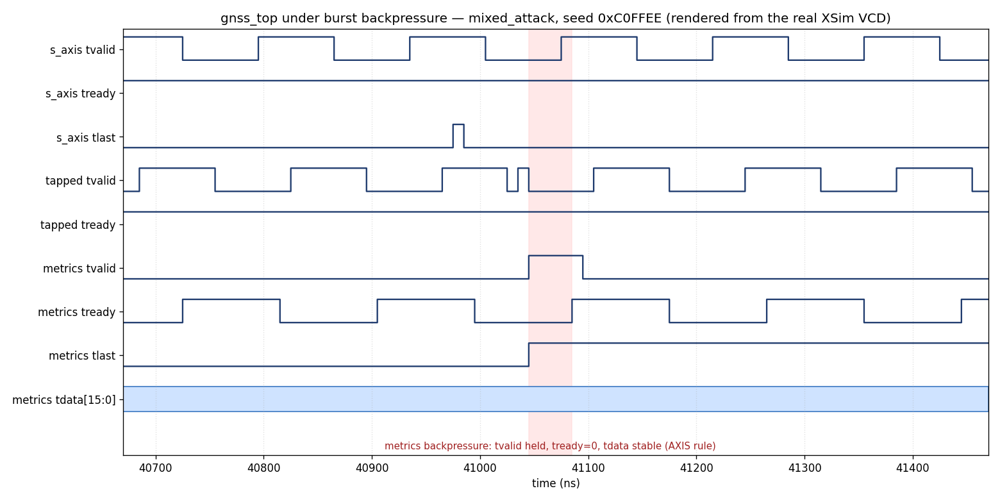

# GNSS Spoofing and Jamming Detection Accelerator (HLS + RTL)


A streaming, fixed-point GNSS anomaly detection accelerator built the way real
FPGA work should be shown: simulation-first, hardware-aware, and verified under
cycle-level AXI4-Stream backpressure. It accepts signed complex I/Q samples and
flags wideband jamming, tone jamming, C/N0 degradation, correlation-symmetry
distortion, delayed spoof-like replicas, Doppler/phase-energy anomalies, and
sudden power jumps.

Author: John Bagshaw — GitHub: [`taitashaw`](https://github.com/taitashaw) —
Repo: `https://github.com/taitashaw/gnss_spoof_jam_detector_hls_rtl` — License: MIT.

This is not a certified GPS receiver. It is a real-time FPGA accelerator that
computes GNSS-relevant anomaly metrics over configurable sample windows, with the
hardware/software partition chosen the way a production design would make it.

---

## 1. Project overview

The accelerator ingests a 32-bit AXI4-Stream of signed I/Q (`I = tdata[31:16]`,
`Q = tdata[15:0]`), mixes it to baseband with an RTL NCO, despreads it against a
PRN-like code with early/prompt/late correlators, computes a battery of anomaly
metrics in a streaming metric engine, and emits one metrics packet per window
carrying per-metric values, a saturated spoof score, a saturated jam score,
packed alert flags, and a cycle-accurate latency measurement.

The design is deliberately split so each part is shown where it is strongest:

- HLS where it is powerful — metric accumulation, fixed-point scoring.
- RTL where it is mandatory — deterministic streaming, NCO/mixer, PRN/LFSR,
  E/P/L tap alignment, threshold and alert packing, latency measurement.
- XSim where reality is proven — valid/ready, backpressure, packet stability,
  latency, and correctness against a single golden model.

## 2. Why GNSS spoof/jam detection matters

GNSS is the silent dependency under timing, navigation, and synchronization for
power grids, telecom, finance, autonomy, and defense. It is also trivially
attacked: a few dollars of RF can jam a band, and a software-defined radio can
transmit a counterfeit constellation that walks a receiver off its true position
or time. Detection has to happen at the front end, in real time, on every sample
window, before a corrupted fix propagates into the system that trusts it. That is
an FPGA problem: deterministic, low-latency, and streaming.

## 3. Why FPGA acceleration matters

A CPU or GPU can compute these metrics, but not with bounded per-window latency
under a continuous high-rate sample stream and not without buffering that defeats
the point. An FPGA processes the stream as it arrives, with a fixed pipeline,
exact fixed-point arithmetic, and a hard latency bound that this project measures
directly with a hardware latency counter rather than estimates. The whole design
avoids floating point in every synthesizable path.

## 4. Hardware bench alignment

The intended bench is a Zynq UltraScale+ class part (ZCU104, `xczu7ev-ffvc1156-2-e`)
with a GNSS RF front-end over FMC and a GPS antenna. The deliverable does not
assume any of that exists yet: it runs entirely from generated synthetic I/Q and
is structured so a real ADC/FMC stream replaces the synthetic input later without
touching the metric engine. See `docs/hardware_bringup_notes.md`.

## 5. Architecture

```
Synthetic or ADC I/Q Stream
        |
        v
AXI4-Stream Skid Buffer
        |
        v
RTL NCO Mixer
        |
        v
RTL PRN / Early-Prompt-Late Generator
        |
        v
HLS GNSS Metric Engine
        |
        v
RTL Alert Packer + Latency Counter
        |
        v
AXI4-Stream Metrics Output
```

## 6. HLS / RTL partitioning

| Block | Domain | Why |
|---|---|---|
| Skid buffer, register slice | RTL | deterministic AXIS flow control |
| NCO mixer | RTL | per-sample phase accumulator, LUT mix, saturation |
| PRN LFSR + E/P/L tap | RTL | deterministic code generation and stream alignment |
| Metric engine | HLS (RTL stand-in in sim) | accumulation and fixed-point scoring |
| Alert packer | RTL | threshold compare, flag packing, latency fold-in |
| Latency / packet counters | RTL | cycle-accurate measurement and health |

The metric engine has two interchangeable implementations behind one identical
port list: a behavioral SystemVerilog model (`rtl/gnss/gnss_metric_hls_model.sv`,
the default so `make xsim` runs without Vitis HLS) and the Vitis-HLS-exported IP
(`hls/src/gnss_metric_hls.cpp`). Swapping them is a one-line change in
`vivado/compile_order.tcl`.

## 7. Data formats

- Input I/Q: AXI4-Stream, 32-bit `tdata` (`I s16` in `[31:16]`, `Q s16` in
  `[15:0]`), `tlast` on the final sample of each window. Default window = 1024.
- Tapped stream (mixer/PRN output to the metric engine): mixed I/Q (s16) plus
  early/prompt/late chip signs plus sample index plus `tlast`.
- Metrics output: one packed AXI4-Stream beat per window. Fields and offsets are
  the single source of truth in `rtl/gnss/gnss_top_pkg.sv`.

The exact metric definitions are in Section 3 of the in-repo spec and implemented
identically in the C reference, the HLS kernel, the SystemVerilog model, and the
Python generator. The golden definitions live in `hls/src/gnss_metric_ref.cpp`.

## 8. How to run

Lead with `make selfcheck` — it needs only `python3` (numpy) and `g++`, no Xilinx
tools, and is the authoritative gate.

```
make selfcheck     # vectors -> C golden sim -> check -> summary  (no Xilinx tools)
make hls-csim      # HLS kernel C-sim vs golden using Vitis ap_int headers (no synth)
make hls           # full Vitis HLS C-sim + synth + export (needs vitis_hls on PATH)
make xsim          # XSim cycle simulation of the 8-scenario matrix (needs Vivado)
make check         # validate whatever results exist against expected flags/ranges
make summary       # write results/summary.md
make help          # list every target and what it requires
```

Toolchain assumptions (override as noted):

- Python 3.10+ with numpy (matplotlib only for optional plots).
- Vitis HLS 2022.2+ for `make hls` (`ap_int`, `ap_axiu`, `hls::stream`).
- Vivado 2022.2+ with XSim for `make xsim`.
- Target part `xczu7ev-ffvc1156-2-e`. Change it in ONE place: `PART` in
  `vivado/compile_order.tcl` (RTL/XSim) and the `PART` line in
  `hls/vitis_hls/run_hls.tcl` (HLS).

## 9. Expected outputs

`make selfcheck` writes `results/<scenario>/actual_metrics.txt` and a
`results/summary.md` table. Each scenario asserts an exact alert-flag set:

| Scenario | Alert flags |
|---|---|
| clean, backpressure | none |
| cn0_drop | cn0_drop |
| delayed_spoof | corr_asymmetry, spoof_score_high |
| doppler_shift | cn0_drop, doppler_anomaly, spoof_score_high |
| wideband_jam, tone_jam | high_power, cn0_drop, doppler_anomaly, spoof_score_high, jam_score_high |
| mixed_attack | all six attack flags |

## Results

Both charts are produced by `make plots` from the real `make selfcheck` / `make xsim`
run over the eight deterministic scenarios (seed `0xC0FFEE`). The C golden model,
the HLS kernel, and the SystemVerilog model all produce these same values.



Spoof and jam scores per scenario against the alert threshold (500). Clean and
backpressure sit near zero; each attack lifts its score past the threshold, and
mixed_attack drives the highest spoof score.



Clean-versus-attack metric signatures with the alert thresholds drawn in. Left:
power and Doppler energy on a log scale — jamming dominates absolute power. Right:
correlation symmetry (the spoof signature, high only for delayed_spoof and
mixed_attack) and the C/N0 proxy line, which collapses under jamming, Doppler, and
C/N0 degradation while staying high for clean and backpressure.

## Synthesis (real, from Vitis HLS 2025.2)

`make hls` ran C simulation, C synthesis, and RTL IP export on this machine. The
numbers below are copied verbatim from the tool report (`docs/synthesis_report.md`,
raw reports in `docs/synth/`); none are estimated by hand:

| Metric | Value |
|---|---|
| C simulation | all 8 scenarios pass, 0 errors |
| ACC_LOOP initiation interval | 1 (target 1), pipelined |
| Clock target / estimated | 5.00 ns / 3.625 ns (uncertainty 1.35 ns) |
| DSP / FF / LUT / BRAM | 4 / 1735 / 4026 / 0 |
| Target part | xczu7ev-ffvc1156-2-e |

These are post-C-synthesis estimates; post-implementation timing closure is a
deferred phase (see the roadmap).

Absolute cycle latency is **not** bounded by synthesis: `WINDOW_SIZE` is a run-time
input, so the accumulation loop's trip count and total latency report as `?` in the
csynth report (synthesis gives throughput, II = 1, but no fixed latency). The real
per-window latency is the XSim-measured **1021 cycles with no backpressure and up to
2038 cycles under burst backpressure** (from `axis_latency_counter`), not a
synthesized figure.

## Verification



A timing diagram rendered from the real XSim value-change dump of the
`mixed_attack` scenario under burst backpressure (seed `0xC0FFEE`,
`scripts/render_wave.py` over `docs/images/mixed_attack.vcd`). The shaded interval
is a metrics-output backpressure event: `m_axis_tvalid` is held while
`m_axis_tready = 0` and `tdata` stays stable, exactly the AXIS rule a functional C
simulation cannot exercise. The input handshake, the tapped stream into the metric
engine, and the packet `tlast` are all visible. Regenerate with `make waves`; open
`mixed_attack.vcd` / `mixed_attack.wcfg` in the Vivado GUI to inspect interactively
(see `docs/images/README.md`).

## 10. Verification strategy

A single golden model wins all ties: `hls/src/gnss_metric_ref.cpp`. The HLS kernel
is checked TIGHT against it; XSim output is checked against loose metric ranges and
exact alert flags; the Python generator's mix/PRN front-end is cross-checked
bit-for-bit against the golden front-end. The XSim flow drives real AXI4-Stream
backpressure (random and burst, seeded and reproducible) and proves the metrics
are unchanged by it. Full detail in `docs/verification_strategy.md`.

## 11. Known limitations

Honest scope is in `docs/known_limitations.md`: this is not a certified GPS
receiver, the PRN generator is PRN-like rather than a full C/A Gold code, C/N0 is
a deterministic proxy, Doppler is a simplified anomaly proxy, and there is no live
RF validation yet. No fabricated resource or timing numbers appear anywhere.

## 12. Future hardware bring-up path

`docs/hardware_bringup_notes.md` describes the ZCU104 PS/PL data path, the
NT1065/FMC front-end work that is gated on real board documentation (FMC pinout,
ADC sample format, clocking and reset constraints), and the smaller Zybo/Basys
educational subsets. The single concrete next step is to replace the synthetic
I/Q source with a captured NT1065 ADC frame at the same s16 I/Q contract and
re-run the existing verification unchanged.

## System Integration

The exported metric IP is integrated into a ZCU104-class Zynq UltraScale+ system
as a reproducible Vivado IP Integrator block design (`vivado/run_bd.tcl`, batch).
The PS drives an AXI DMA that streams data into the kernel (MM2S to `tap_in`,
64-bit) and writes the 512-bit metrics packets back (`metric_out` to S2MM), with
the control plane over AXI4-Lite. The default variant also exposes external
`fmc_iq_in` / `metrics_out_ext` AXI4-Stream ports (an input switch + output
broadcaster) for a direct FMC/ADC front-end path alongside the DMA. The block
design **validates with zero critical warnings**. Full detail and the PS/PL
datapath are in `docs/system_integration.md`.


The design was **placed, routed, and a bitstream generated** (DMA-only deployable
variant — the external 512-bit metrics bus would exceed the package I/O). Real
post-implementation results on the `xczu7ev`, verbatim in
`docs/implementation.md` / `docs/synth/impl_*.rpt`:

| Metric | Value |
|---|---|
| Timing | WNS +4.484 ns, TNS 0.0, 0 failing endpoints — closes |
| LUT / FF | 10044 (4.36%) / 16882 (3.66%) |
| BRAM / DSP | 10 tiles (3.21%) / 4 (0.23%) |
| Bitstream | generated (`write_bitstream Complete!`) |

Status: block design validated, synthesized, implemented (timing closed), and
bitstream generated; **not yet flashed to a board.**

## Real-Data Validation (TEXBAT)

The 8 synthetic scenarios remain the primary functional suite. As an additional
check on **real recorded GPS spoofing data** (not synthetic, not re-transmitted),
the pipeline was run over two scenarios from the Texas Spoofing Test Battery
(TEXBAT, UT Austin Radionavigation Lab; Humphreys et al., ION GNSS+ 2012): **ds2**
(overpowered time-push) and **ds7** (matched-power SCER, the hardest class). Clean
and post-onset slices (128 windows each) were read directly from the local ~43 GB
`.bin` files by byte offset — the files are never loaded whole and **never
committed** (referenced by path + SHA256 + citation).

On the real data, both the C reference and XSim (bit-exact) show:

- **ds2:** `power_estimate` +225% and `doppler_energy` +158% at the attack — a
  clear response to the overpowered spoofer.
- **ds7:** all metrics move under 8% — the matched-power SCER attack is not clearly
  flagged. ds7 is decisively harder than ds2.

Honest scope: this is a pre-tracking anomaly accelerator with a PRN-like LFSR, not
a C/A tracking receiver, so the correlation metrics do not provide despread-based
discrimination (full C/A acquisition is the next step). Full method, tables, the
null result, and provenance are in `docs/texbat_validation.md`.

## Roadmap — deferred phases

What is done is stated plainly above: the golden model, the RTL datapath, full
XSim cycle verification under backpressure, Vitis HLS C synthesis, and the
validated Zynq UltraScale+ block design that is implemented (timing closed) with a
generated bitstream. The following are pending hardware, not done yet:

1. On-board bring-up on a ZCU104-class board (programming the device over JTAG).
2. ILA / hardware debug verification of the live datapath.
3. NT1065 FMC RF front-end capture replacing the synthetic I/Q source, gated on the
   board documentation listed in `docs/hardware_bringup_notes.md`.

## 13. Technical summary

I built a GNSS spoofing and jamming detector the way real FPGA work should be
shown: not a clean functional demo, but a streaming HLS and RTL design verified
under cycle-level AXI4-Stream backpressure. Signed complex I/Q streams in; an RTL
NCO mixer and PRN early/prompt/late generator feed a fixed-point metric engine
that computes correlation symmetry, a division-free C/N0 proxy, an FFT-free
Doppler-energy proxy, and saturated spoof and jam scores; an RTL alert packer
emits one metrics packet per window with packed alert flags and a cycle-accurate
latency count. Every metric is defined once in a golden C reference and matched by
the HLS kernel, the SystemVerilog model, and the Python generator. The point is
the verification: the same eight scenarios pass under no stalls, random stalls,
and burst backpressure with identical results, because valid/ready is correct —
which is exactly the property a functional demo never proves. This is the kind of
evidence ShawSilicon (shawsilicon.ai) builds for verifying FPGA and ASIC engineers
before companies spend interview cycles.
