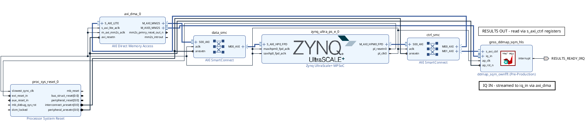
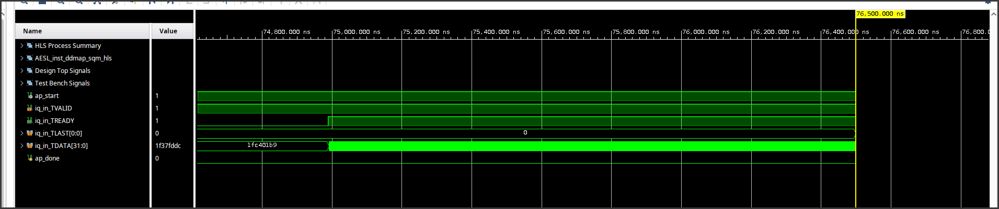
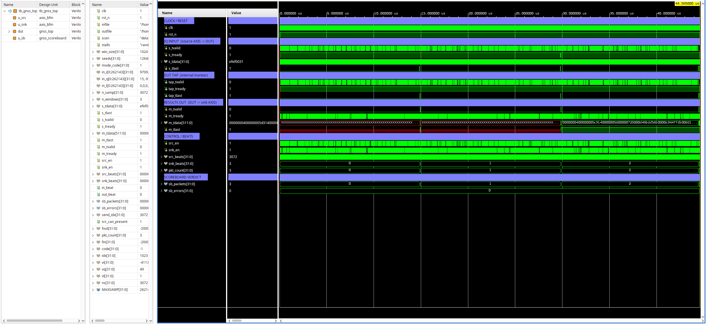
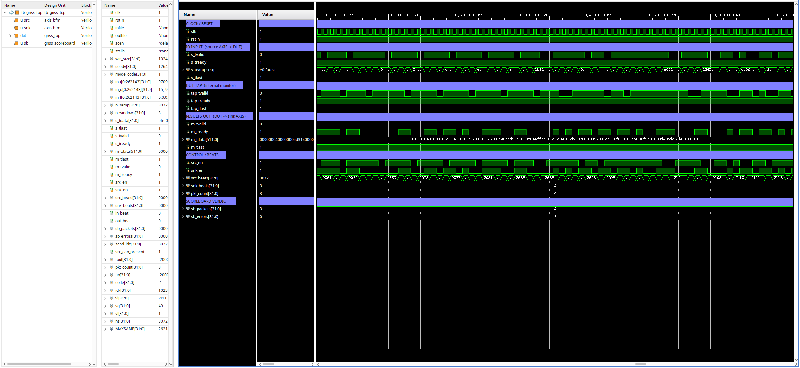

# GNSS Spoofing and Jamming Detection Accelerator (HLS + RTL)


Author: John Bagshaw <jotshaw007@gmail.com> — License: MIT (c) 2026 John Bagshaw

A fixed-point FPGA accelerator that detects GPS L1 C/A **spoofing** and **jamming**
from the acquisition **delay-Doppler map (ddMap)**. It runs a single-pass DBZP
(double-block zero-padding) coherent acquisition, builds the ddMap with a
**from-scratch, numpy-verified fixed-point FFT**, and reads two attack signatures off
it: early/late **signal-quality-monitoring (SQM) distortion** for spoofing, and ddMap
energy / noise-floor elevation for jamming. Validated on real recorded spoofing
(TEXBAT ds2/ds7) and synthesized to **488.76 MHz** on a Zynq UltraScale+ (ZCU104).

The detection algorithm is a clean-room MIT re-implementation of the author's own
published GPS receiver (York University, Prof. Sunil Bisnath); nothing is fabricated
— every number below is verbatim from a committed report.

## 1. The detector at a glance

```
Pre-wiped, decimated I/Q  (one 1 ms C/A block, 2046 samples @ 2.046 Msps)
        |
        v
+---------------------------------------------------------------+
|  ddMap / SQM detector  (hls/src/ddmap_sqm_hls.cpp)            |
|                                                              |
|  on-chip C/A code (G1/G2 Gold code)  --FFT-->  conj          |
|                                                  |           |
|  block I/Q  --FFT-->  x ----------------> IFFT --+--> corr   |
|                                                  (coherent   |
|                                       accumulate over N_BLK) |
|                                                  |           |
|                          delay-Doppler-map cell -+           |
|                                                  |           |
|     peak power | code phase | early/late SQM distortion      |
+---------------------------------------------------------------+
        |
        v
  spoof = distortion > threshold ; jam = floor / energy elevation
```

One call computes one ddMap cell (one PRN, one Doppler hypothesis, `N_BLK = 4`
coherent 1 ms blocks). The carrier-Doppler wipeoff and the outer PRN/Doppler search
loop are the host's job. The FFT (forward and inverse) is the same shared
`fft_fixed` instance, reused for the code FFT, the per-block FFT, and the IFFT.

See `docs/architecture.md` for the full signal path and `docs/single_pass_detection.md`
for the detection theory.

## 2. Why it matters

GNSS underpins timing and navigation for power grids, finance, telecom and aviation.
Spoofing (a counterfeit constellation that captures the receiver) and jamming
(broadband denial) are cheap and increasingly common. A real-time hardware monitor
that flags both directly from the acquisition map — without a full tracking receiver
— is a practical front-line defense. The hardest spoofing class, matched-power SCER
(security-code estimation and replay, TEXBAT ds7), is exactly what the SQM distortion
metric catches here.

## 3. The FFT — from-scratch, numpy-verified (the heart of the design)

The ddMap correlation needs an FFT. Rather than depend on a vendor IP whose
bit-accurate C-model could not be simulated on this install, the detector uses an
own **radix-2 decimation-in-time fixed-point FFT** (`hls/src/fft_fixed.hpp`,
`docs/fft_fixed_design.md`):

- N = 2048, `ap_fixed<24,4>` data / `ap_fixed<18,2>` twiddles, compile-time twiddle
  ROM, per-stage /2 scaling, convergent rounding. No vendor FFT, no float in the body.
- **Hard accuracy gate vs `numpy.fft` (must pass before use):** SNR ≥ 50 dB on every
  test vector. Measured (`hls/tb/tb_fft_fixed.cpp`, plain csim): impulse exact, tone
  **96.5 dB / 15.7 ENOB**, random 83.9 dB / 13.6 ENOB, C/A block **85.6 dB / 13.9
  ENOB**, worst case impulse7 54.7 dB / 8.8 ENOB, ifft(fft(x)) round-trip 68 dB. Gate
  **PASSED** before the FFT was wired into the detector.

Because this FFT is ordinary C++ with no vendor model, the detector's C-simulation
actually runs — which is how a latent on-chip C/A shift-sign bug was caught and fixed.

## 4. Detector C-simulation vs the Python golden

`hls/tb/tb_ddmap_sqm_hls.cpp` runs the synthesizable kernel against the Python golden
(`scripts/ddmap_hls_vectors.py`) at the matched 2-samples/chip config. **PASS:**

| case | kernel peak | golden peak | kernel distortion | golden distortion |
|---|---|---|---|---|
| clean PRN 5 | 600 (exact) | 600 | 0.3305 | 0.3305 |
| ds7 spoofed PRN 23 | 1393 (exact) | 1393 | 0.799 | 0.799 |
| wrong PRN 6 | peak 47.5× lower than correct | — | — | — |

Correct-PRN code phase is exact, wrong-PRN cross-correlation is suppressed 47.5×, and
the ds7-spoofed SQM distortion (0.799) is well above the clean floor (0.330).

## 5. Synthesis — real numbers (Vitis HLS 2025.2, xczu7ev-ffvc1156-2-e)

Verbatim from `docs/synth/ddmap_ownfft_csynth.rpt` (own-FFT detector):

| Metric | Value |
|---|---|
| Timing target / estimated | 2.50 ns / **2.046 ns** = **488.76 MHz** (+0.45 ns slack) |
| BRAM_18K | 58 / 624 (9%) |
| DSP | 14 / 1728 (1%) |
| FF | 7878 / 460800 (2%) |
| LUT | 9539 / 230400 (4%) |
| Latency (one ddMap cell) | 271,504 cycles (~0.56 ms); FFT butterfly II=2 |

The 400 MHz target was met at **488.76 MHz**, closed by retiming only (ping-pong FFT
memory, DSP-registered butterfly, multipliers replaced by shifts, partial-max SQM
reduction) with **no accuracy change** — both gates above still pass. Full method and
the cost (latency 80,208 → 271,504 cycles, DSP 86 → 14) are in
`docs/synth/ddmap_kernel_NOTES.md`.

## 6. Real-data validation (TEXBAT)

Texas Spoofing Test Battery (UT Austin Radionavigation Lab, Humphreys et al., ION
GNSS+ 2012). The ~43 GB `.bin` files are never committed — referenced by path +
SHA256 + citation only (`docs/texbat_validation.md`). Slices: ds2 clean t=20 s /
spoofed t=150 s; ds7 clean t=20 s / spoofed t=250 s; 10 ms coherent, 25 Msps decimated
by 2; the early/late distortion threshold ≥ 0.50, gated on the clean-slice
false-alarm rate. Measured over the acquired satellites (`docs/single_pass_detection.md`):

| scenario | peak-distortion clean false-alarm | spoofed detection | separates? |
|---|---|---|---|
| **ds7** (matched-power SCER) | **0%** | **100%** | **yes** |
| ds2 (overpowered time-push) | 0% | 0% | no (caught by absolute power, not shape) |

ds7 — the hardest spoofing class — is detected at 100% with 0% clean false-alarm by
the SQM distortion. ds2 is an overpowered displaced-but-clean peak that the
distortion metric honestly does not separate; it is caught by absolute power /
ddMap energy. Sample scope is one slice per scenario over the acquired satellites —
a measured result, not a full ROC.

## 7. Benchmark — DBZP ddMap vs the PCS baseline

Head-to-head on the same inputs (`scripts/benchmark.py`,
`docs/comparison_baseline_vs_ddmap.md`), reported as measured:

- **Sensitivity:** DBZP minimum detectable C/N0 is **+1 dB (4 ms) / +2 dB (10 ms)**
  better than parallel-code-search at matched ~1% false-alarm — inside the
  literature-consistent ~2–3 dB band, not a tens-of-dB anomaly.
- **Spoof (ds7):** both detect at 100% / 0% clean FA; DBZP acquires more satellites
  (10 vs 3) → more coverage.
- **Cost:** a trade — DBZP needs ~3× fewer large FFTs at fine Doppler but ~2× the
  working memory.

## 8. Latency + CDC audit

`docs/audit_latency_cdc.md` (measured from the csynth report and Vivado
`report_cdc`):

- **Latency:** one ddMap cell = 271,504 cycles = 555.5 µs @ 488.76 MHz, consuming
  4 ms of data → **7.2× per-cell real-time headroom** (budget ~7 cells per 4 ms
  window). **Verdict: meets the real-time monitoring deadline.**
- **CDC:** the PL fabric is single-clock (`clk_pl_0`, 96.97 MHz); the kernel exposes
  only `ap_clk`. `report_cdc` on the routed design = **"All paths are Safely Timed"**
  (0 critical, 0 warning). No CDC findings on the current design.
- **Decision:** HLS passes — no RTL overhaul. A streaming SDF FFT would add throughput
  headroom but is not required by the deadline.

## 9. System integration (block design + AXIS waveform)

The current own-FFT kernel is exported as IP (`xilinx.com:hls:ddmap_sqm_hls:1.0`,
`hls/vitis_hls/run_export_ownfft.tcl`) and integrated into a Zynq UltraScale+ block
design (`vivado/run_bd_gnss_spoof_jam_detector_system.tcl`) that **validates with zero critical warnings**:
PS → AXI DMA (MM2S) → kernel `iq_in`, results read back over the kernel's
`s_axi_ctrl` registers (the kernel has no AXIS output — results are register reads,
not an S2MM stream).

The image below is a screenshot of the actual Vivado IP Integrator canvas.



C/RTL co-simulation (`cosim_design`) **passes** — possible now that the FFT is our
own (the vendor FFT C-model blocked it before). The screenshot below is the **actual
Vivado XSim waveform viewer** on that cosim, zoomed to the kernel's `iq_in`
AXI4-Stream backpressure interval: `iq_in_TREADY` held **low** while the kernel
computes the C/A generation and the code FFT, then **rising to high** at ~75 us to
read a 2048-beat block, with `iq_in_TDATA` beginning to stream at that edge
(`iq_in_TVALID` high, `TLAST`/`ap_done` low) — genuine kernel-side backpressure.



**Full-system RTL simulation** — the complete detector running in Vivado XSim (`tb_gnss_top` driving `gnss_top`), `delayed_spoof` scenario: IQ stream in via AXI4-Stream, through the NCO/PRN/correlator datapath, results out, with the scoreboard reporting **3/3 packets captured, 0 errors**.



Cycle-level view of the AXI4-Stream handshake (`s_tvalid`/`s_tready`, internal `tap_*` monitor, and `m_tdata` results) at beat resolution:



## 10. How to run

```
python3 scripts/gen_fft_twiddle.py                 # twiddle ROM (compile-time)
python3 scripts/gen_fft_vectors.py                 # FFT test vectors + numpy golden
g++ -std=c++14 -I hls/include -I $VITIS/include \
    hls/tb/tb_fft_fixed.cpp -o fft_test && ./fft_test .     # FFT accuracy gate
python3 scripts/ddmap_hls_vectors.py               # detector vectors + golden
vitis-run --mode hls --tcl hls/vitis_hls/run_ddmap_ownfft.tcl   # detector csim + csynth (2.5 ns)
```

`scripts/dbzp_acq.py` / `scripts/pcs_acq.py` / `scripts/benchmark.py` reproduce the
acquisition, baseline, and benchmark on real TEXBAT data.

## 11. Verification hierarchy

numpy FFT accuracy gate → detector C-sim vs the Python golden → (XSim cycle sim of the
RTL front-end) → TEXBAT real-data validation → latency + CDC audit. Details in
`docs/verification_strategy.md`. The single golden source for the detection math is
`scripts/dbzp_acq.py` / `scripts/gps_ca.py`.

## 12. Legacy streaming front-end (superseded — not the detector)

An earlier version of this repo implemented a **streaming anomaly metric engine**: an
RTL NCO mixer → PRN LFSR / early-prompt-late tap → fixed-point HLS metric engine →
alert packer, with its own synthesis, block design, and bitstream. That subsystem is
**superseded** by the ddMap/SQM detector above and is **not** the current detection
core. Its files are retained for reference and clearly labeled as legacy:

- RTL: `rtl/gnss/{nco_mixer,prn_lfsr_gen,gnss_alert_packer}.sv` and their testbenches.
- Config/types: the NCO/PRN/metric/CN0 constants in `hls/include/gnss_config.hpp`
  (legacy section), `gnss_types.hpp`, `axis_types.hpp`.
- Docs (labeled superseded): `docs/synthesis_report.md`, `docs/implementation.md`,
  `docs/system_integration.md` — their numbers (DSP 4 / FF 1735 / LUT 4026 / BRAM 0;
  block-design BRAM 10 / DSP 4) describe the legacy metric kernel, **not** the current
  detector. No legacy number is presented as the current design's.

No part of the current detector depends on the legacy front-end; the detection itself
is the ddMap/SQM core.

## 13. Provenance and integrity

Detection algorithms are a clean-room MIT re-implementation of the author's published
MATLAB receiver (`norm_acq_parcode` baseline, `weak_acq_optimized_DBZP` candidate;
York University, Prof. Sunil Bisnath). Every synthesis/timing/accuracy number in this
README is verbatim from a committed report under `docs/synth/` or `docs/`. TEXBAT
`.bin` files are never committed (path + SHA256 + citation only). Negative results
(ds2 not separated by distortion; the legacy metric kernel superseded) are reported.
