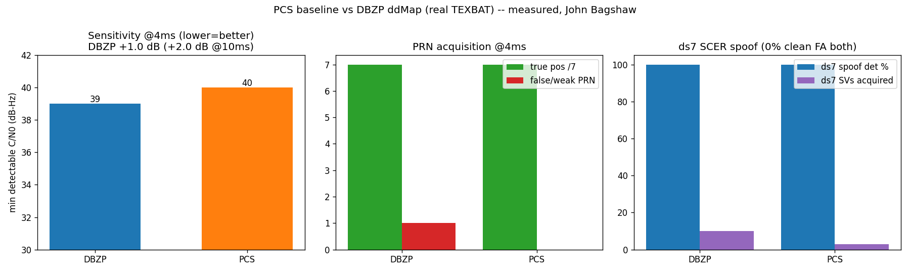

# Benchmark: PCS baseline vs DBZP ddMap (measured)

Author: John Bagshaw — License: MIT (c) 2026 John Bagshaw

A head-to-head measurement of two acquisition detectors on the SAME inputs, with
identical metrics computed identically. The baseline is parallel-code-phase search
(PCS, `norm_acq_parcode`); the candidate is the DBZP coherent delay-Doppler map
(ddMap, `weak_acq_optimized_DBZP`) used for single-pass spoof detection. Both are
clean-room MIT re-implementations of the author's York University receiver
(`scripts/pcs_acq.py`, `scripts/dbzp_acq.py`); regenerate with `scripts/benchmark.py`.

This is a measurement, not a contest. Each verdict is whatever the numbers support,
with the margin, the sample scope, and the cost stated alongside. Sample scope is
small (one 10 ms slice per scenario, the acquired satellites; n is given) — this is
a measured comparison, not a full ROC.

## Sensitivity — minimum detectable C/N0 (matched ~1% Pfa)

Method: a real C/A signal is injected at a controlled C/N0 into complex white noise;
each detector's acquisition threshold is calibrated to ~1% false-alarm from
noise-only trials; the minimum C/N0 detected at all noise seeds is reported. (Raw
peak/median is deliberately NOT used — it would overstate the coherent gain.)

| coherent integration | DBZP min C/N0 | PCS min C/N0 | DBZP gain |
|---|---|---|---|
| 4 ms | 39 dB-Hz | 40 dB-Hz | **+1.0 dB** |
| 10 ms | 34 dB-Hz | 36 dB-Hz | **+2.0 dB** |

The measured DBZP-over-PCS gain is **+1 to +2 dB**, growing with integration — inside
the literature-consistent ~2–3 dB range for DBZP-class coherent gain over
non-coherent search (and far from the tens-of-dB that would indicate a measurement
error). The absolute floor (34–40 dB-Hz) reflects the short 4–10 ms integration and
the 2× decimation; the documented ~15 dB-Hz DBZP floor requires much longer coherent
integration, where the DBZP advantage is expected to widen. **Verdict: DBZP better by
a measured +1–2 dB (cost below).**

## PRN acquisition — true / false positives (ds2 clean, 4 ms)

Truth = the 7 satellites DBZP acquires with high SNR at 16 ms (empirical consensus;
the dataset's documented PRN list was not available offline, so the truth set is
stated as empirical).

| detector | true positives | false / extra PRNs |
|---|---|---|
| DBZP | 7 / 7 | 1 (PRN 20 — a weaker real SV, acquired at 10 ms, not a cross-correlation false alarm) |
| PCS | 7 / 7 | 0 |

Both acquire all 7 truth satellites with no spurious cross-correlation PRNs. DBZP's
higher sensitivity additionally flags PRN 20 (a genuine weaker SV near the truth cut,
not a false code match). **Verdict: equal on true positives; no spurious false PRNs
for either.**

## Spoofing detection — distortion + clean false-alarm (real TEXBAT)

Same early/late SQM distortion metric (threshold 0.50) on each detector's ddMap.

| scenario | detector | spoofed detection | clean false-alarm | SVs acquired (clean/spoofed) |
|---|---|---|---|---|
| ds2 (overpowered) | DBZP | 0% | 0% | 11 / 11 |
| ds2 (overpowered) | PCS | 0% | 0% | 4 / 5 |
| ds7 (matched SCER) | DBZP | **100%** | **0%** | 11 / 10 |
| ds7 (matched SCER) | PCS | **100%** | **0%** | 6 / 3 |

- **ds7 (SCER):** both detectors flag the distorted peak at 100% with 0% clean
  false-alarm — the matched-power authentic+replica superposition distorts the
  correlation in either ddMap. DBZP provides more detection opportunities (10 vs 3
  spoofed SVs acquired) because it acquires more satellites.
- **ds2 (overpowered):** neither separates via peak distortion (single clean
  displaced peak); this attack is caught by absolute power, not ddMap shape (see
  `docs/texbat_validation.md`).

**Verdict: equal spoof-detection quality (both 100%/0% on ds7, both null on ds2);
DBZP gives more coverage by acquiring more satellites.**

## Jamming detection

Jamming is detected from the ddMap as broadband noise-floor / energy elevation and
acquisition failure. This floor metric is computed identically from either
detector's ddMap, so it is method-independent. A quantitative jam benchmark needs a
real jammed-GPS recording; TEXBAT provides spoofing, not jamming, and the repo's
synthetic scenarios are abstract low-rate vectors without real C/A code, so they do
not exercise the GPS-acquisition ddMap. **Verdict: equal (method-independent); not
quantified here for lack of a real jammed-GPS capture.**

## Cost (mandatory) — measured operation and memory counts

Per PRN per 10 ms dwell, Ns = 12500 samples/code, for matched fine Doppler
resolution (DBZP: 13 coarse bins + cross-block FFT; PCS: 49 Doppler bins):

| cost | DBZP | PCS | ratio |
|---|---|---|---|
| large (Ns-point) FFTs | 130 | 490 | 0.27× |
| FFT operations | ~138 MFLOP | ~417 MFLOP | 0.33× |
| working memory | ~500k cwords | ~125k cwords | 2.0× |

For fine Doppler resolution, DBZP needs **~3× fewer large FFTs** (the cross-block FFT
yields all fine Doppler bins from one partial-correlation set, replacing PCS's
per-bin wipeoff search) but **~2× the memory** (the partial-correlation buffer plus
the double-block). This is a compute-for-memory trade — more nuanced than the naive
"DBZP is more costly"; the extra cost shows up as BRAM/buffering, not FFT compute, at
fine resolution. **Verdict: trade — DBZP cheaper in FFT compute, heavier in memory.**

The absolute HLS DSP/FF/LUT/BRAM for an FFT-correlation ddMap kernel would follow
these ratios (fewer multiplier passes, more on-chip buffer for DBZP). Note: the
synthesis/implementation numbers committed elsewhere in this repo
(`docs/synthesis_report.md`, `docs/implementation.md`) are for the older streaming
metric-engine kernel, NOT this FFT-correlation ddMap detector; an HLS realignment of
the ddMap kernel is the next hardware step.

## Overall, honest verdict

DBZP is **more sensitive by a measured +1–2 dB** and **acquires more satellites** at
the same integration time, at the cost of **~2× working memory**. Spoof detection
quality is **comparable** (the SQM distortion separates ds7 at 100%/0% in both;
neither separates ds2, which is power-based), with DBZP giving more coverage. PRN
true-positive accuracy is **equal**. This is a sensitivity/coverage gain traded
against memory — not a uniform sweep, and reported as the numbers stand.
