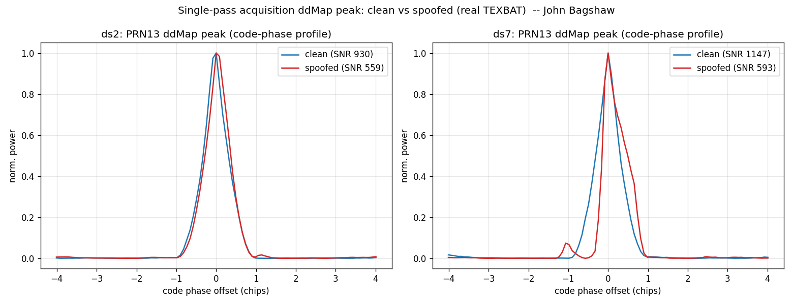

# Single-Pass Spoof Detection from the Acquisition Delay-Doppler Map

Author: John Bagshaw — License: MIT (c) 2026 John Bagshaw

This adds spoof/jam detection computed **directly from the acquisition delay-Doppler
correlation map (ddMap)** — one processing phase. The detection statistics are
functions of the same ddMap the acquisition already produces; there is no separate
tracking or post-processing pass. High sensitivity comes from DBZP coherent
integration. Every claim below is gated on the measured clean-slice false-alarm
rate.

## Source and credit

The acquisition is a clean-room, MIT-licensed re-implementation in Python, faithful
to the algorithm in the author's own published MATLAB receiver — "Fast GNSS Receiver
MATLAB" (`weak_acq_optimized_DBZP.m`, `norm_acq_parcode.m`, `gen_ca_code.m`):
John Bagshaw, supervised by Prof. Sunil Bisnath, York University, Canada. The real
GPS L1 C/A Gold codes are generated by the standard G1/G2 LFSRs (IS-GPS-200).
(The GPL-derived `make_ca_table.m` was not vendored; the upsampling is re-derived.)

This real-C/A correlation detection replaces, where it earns its place, the
PRN-like-LFSR front end used elsewhere in the repo. The earlier pre-tracking
TEXBAT result (`docs/texbat_validation.md`) explicitly reported a null on ds7
*because* the LFSR front end does not acquire the real C/A code — that is the
limitation this real-C/A acquisition addresses.

## One pass: detection is a function of the ddMap

`scripts/dbzp_acq.py::acquire` builds the ddMap for a PRN by coherently integrating
`coherent_ms` one-millisecond C/A correlations (a cross-block FFT — the DBZP
coherent-gain mechanism). `detection_metrics` then reads the spoof/jam statistics
off that same ddMap:

- (a) PEAK COUNT — peaks above an adaptive threshold separated by more than a
  multipath guard interval (>1 ⇒ spoof candidate).
- (b) PEAK DISTORTION / SYMMETRY — early/late asymmetry of the main peak versus the
  ideal symmetric C/A triangle (a superposition-of-triangles distortion metric).
- (c) PEAK RATIO — strongest secondary-peak power relative to the main peak.
- (d) NOISE-FLOOR / ddMap energy spread — for jamming.

These map onto the repo's `spoof_score` / `jam_score` / `alert_flags`: the
early/prompt/late distortion is the real-C/A version of the existing symmetry term.

## Acquisition produced a valid ddMap on the real slices

On the ds2 clean slice (t = 20 s, 10 ms coherent, 25 Msps decimated by 2), the
acquisition acquires **11 GPS satellites** at physically sensible Dopplers
(−3.3 … +2.6 kHz) and distinct code phases (e.g. PRN 13 SNR 930 @ +1900 Hz, PRN 3
549 @ +700 Hz, …), with non-visible PRNs below threshold. A synthetic
known-code/Doppler signal is acquired exactly and wrong PRNs stay at the
cross-correlation floor (algorithm self-test in the code). The ddMap is real.

## DBZP sensitivity (the weak-signal evidence, measured)

Peak SNR (peak / median noise floor) versus coherent integration length, ds2 clean:

| coherent ms | PRN 13 SNR | PRN 6 SNR |
|---|---|---|
| 1 | 169 | 42 |
| 2 | 230 | 93 |
| 5 | 285 | 142 |
| 8 | 691 | 255 |
| 12 | 747 | 294 |
| 20 | 1551 | 446 |

The peak SNR rises with coherent integration (the coherent gain). A satellite below
the acquisition threshold at 1 ms (PRN 6, SNR 42 < 60) is solidly acquired by 8 ms
(SNR 255). This measured trend is the only basis for the high-sensitivity claim.

## Single-pass detection results (real TEXBAT, gated on clean false-alarm)

Each metric is evaluated over every acquired PRN; the table reports the spoofed
detection rate AND the clean-slice false-alarm rate at the same threshold.

The peak plot (strongest PRN) tells the story: ds2 spoofed is a clean, slightly
displaced C/A triangle; ds7 spoofed is a heavily distorted, asymmetric peak (a
superposition of the authentic and the delayed SCER replica).

### ds2 — overpowered time-push

| metric | clean false-alarm | spoofed detection | separates? |
|---|---|---|---|
| peak distortion (≥0.50) | 0% | 0% | no |
| peak count (≥2) | 9% | 0% | no |
| peak ratio (≥0.40) | 0% | 0% | no |

ds2 distortion: clean ≤0.30, spoofed ≤0.24 — the spoofed peaks are **not** distorted.
The overpowered spoofer produces a single, clean, displaced peak; the ddMap *shape*
carries no spoof signature. ds2's signature is **power**, not peak structure
(+225% power at onset, reported in `docs/texbat_validation.md`).

### ds7 — matched-power SCER (the "hardest" class)

| metric | clean false-alarm | spoofed detection | separates? |
|---|---|---|---|
| peak distortion (≥0.50) | **0%** | **100%** | **yes** |
| peak count (≥2) | 18% | 0% | no |
| peak ratio (≥0.40) | 0% | 0% | no |

ds7 distortion: every spoofed PRN is 0.76–0.99; clean PRNs are ≤0.45. At threshold
0.50 this is **100% detection with 0% false-alarm** over the acquired satellites.

### Honest reading (this revises the naive expectation)

The naive expectation was that ds2 (separable peak) would be detectable single-pass
and ds7 (coherent SCER) would not. The real data shows the **opposite** for the
ddMap *structure* metrics, and the physics explains it:

- The early/late distortion metric detects two signals that **coexist** on the same
  PRN — it is a signal-quality-monitoring statistic. In ds7's matched-power SCER, at
  t = 250 s the authentic signal and the delayed replica are both present and overlap
  by a fraction of a chip, producing the strongly asymmetric peak the metric flags.
- ds2's overpowered spoofer dominates and the authentic is buried, leaving a single
  clean (displaced) peak — no structural distortion. That attack is caught by the
  absolute-power statistic, not the ddMap shape.

So: single-pass ddMap distortion detects the **matched-power coexisting** spoofer
(ds7 here: 100% / 0% FA); the overpowered ds2 is detected by power, not peak shape.
Caveats reported plainly: this result is from one 10 ms slice per scenario over the
acquired satellites; the distortion is detectable here because the SCER replica is
imperfectly code-aligned (a real but spoofer-dependent property) — a perfectly
code/carrier/Doppler-aligned single-antenna spoofer would leave no single-pass
signature, the documented physics limit. peak_count and peak_ratio did **not**
separate either attack (clean multipath produced as many secondary peaks).

## HLS / RTL partition (only for the metric that separated)

Only the distortion path earns synthesis (peak_count / peak_ratio did not separate,
so no detector is built for them):

- **ddMap build — HLS.** The per-block FFT circular correlation against the real C/A
  code and the coherent cross-block FFT are the FFT-correlation datapath; this is the
  heavy, regular arithmetic HLS targets (same role as the existing metric kernel),
  parameterized by `coherent_ms`.
- **Early/prompt/late distortion — RTL.** Reading the three correlator taps around
  the located main peak and forming `|early − late| / (early + late)` is a few
  adds/compare/divide; it sits in the streaming alert path next to the existing
  `gnss_alert_packer`, replacing the LFSR-front symmetry term with the real-C/A one.

This keeps the existing pipeline intact and adds real-C/A correlation detection only
where the data shows it works.

## Provenance

Slices are read directly from the local TEXBAT `.bin` by byte offset (the ~43 GB
files are never loaded whole and never committed; SHA256 + citation in
`docs/texbat_validation.md`). Re-run with `scripts/dbzp_eval.py`.
